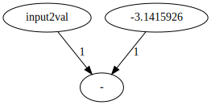

Министерство науки и высшего образования Российской Федерации федеральное государственное автономное образовательное учреждение высшего образования

«Национальный исследовательский университет ИТМО»

---
__ФПИиКТ, Системное и Прикладное Программное Обеспечение__

__Лабораторная работа №4__

по Функциональному программированию

Выполнил: Ханнанов Л. И.

Группа: P34112

Преподаватель: Пенской Александр Владимирович

###### Санкт-Петербург
###### 2023 г.

---

## Требования к разработанному ПО

* eDSL для описания графов вычислительного процесса с моделью вычислений: Synchronized Data Flow
* eDSL должен быть запускаемым и генерирующим описание в формате dot (подробнее см. проект graphviz)
* С использованием данного eDSL реализовать алгоритм расчёта корней квадратного уравнения
* Использовать очереди

## Ключевые элементы реализации с минимальными комментариями

```
;;; грамматика eDSL в расширенной форме Бэкуса-Наура (eBNF): lang/parser.rkt
#lang brag

gsdf-program : statement*

statement : assignment

assignment : IDENTIFIER "=" expr

expr : [unary-op] ident-or-const
  | ident-or-const binary-op ident-or-const

ident-or-const : IDENTIFIER | CONSTANT

unary-op : "-"
  | "sqrt"

binary-op : "+"
  | "-"
  | "*"
  | "/"
```

### Схема взаимодействия модулей
```
  (lexer, tokenizer)
          V
        parser
          V
        reader
          V
       expander
          V
  backend (исполняет eDSL)
```

```racket
;;; "раскрыватель" конструкций языка lang/expander.rkt
#lang br/quicklang

(require racket/contract
         racket/generator)

(define (undefined-op op)
  (error 'op "operation ~a unknown~n" op))

(struct queue (id in out) #:transparent)
(struct node (id value) #:transparent)

(define next-node-id (sequence->generator (in-naturals)))

(define next-queue-id (sequence->generator (in-naturals)))

(define-macro (gsdf-module-begin PARSE-TREE) #'(#%module-begin PARSE-TREE))
(provide (rename-out [gsdf-module-begin #%module-begin]))

(define-macro (gsdf-program STATEMENTS ...)
              #'(let-values ([(nodes queues) (fold-program (list STATEMENTS ...))])
                  (void (build-ir nodes queues))))
(provide gsdf-program)

(define operations (hash + "add" - "sub" * "mul" / "div" sqrt "sqrt"))

(define (build-ir nodes queues)
  (let ([nodes (sort (hash-values nodes) < #:key node-id)])
    (for ([n nodes])
      (for ([q queues])
        (let ([id (node-id n)] [in (queue-in q)] [out (queue-out q)])
          (printf (~a #:align 'right
                      #:min-width 3
                      (cond
                        [(= in id) 1]
                        [(= out id) -1]
                        [else 0])))))
      (newline))
    (newline)
    (for ([n nodes])
      (printf (match (node-value n)
                [(? procedure? op)
                 (format "~a~n" (hash-ref operations op (lambda (op) (undefined-op op))))]
                [(? number? constant) (format "imm ~a~n" constant)]
                [(? string? identifier) (format "val ~a~n" identifier)])))))

(define/contract (fold-program statements)
                 ((listof procedure?) . -> . (values hash? (listof queue?)))
                 (for/fold ([nodes (hash)] [queues null]) ([stmt (in-list statements)])
                   (stmt nodes queues)))

(define-macro (statement ASSIGNMENT) #'(lambda (nodes queues) (ASSIGNMENT nodes queues)))
(provide statement)

(define-macro
 (assignment IDENTIFIER "=" EXPRESSION)
 #'(lambda (nodes queues)
     ; test if value already assigned
     (when (hash-has-key? nodes IDENTIFIER)
       (error 'assignment "name ~a already in use~n" IDENTIFIER))
     ; actual work
     (let* ([op (car EXPRESSION)]
            [args (cdr EXPRESSION)]
            [nodes
             (for/fold ([updated-nodes nodes]) ([arg args])
               (hash-set updated-nodes arg (hash-ref updated-nodes arg (node (next-node-id) arg))))]
            [acc-node (node (next-node-id) op)]
            [arg-ids (map (compose node-id (curry hash-ref nodes)) args)]
            [arg-queues (map (lambda (arg-id) (queue (next-queue-id) arg-id (node-id acc-node)))
                             arg-ids)])
       (values (hash-set nodes IDENTIFIER acc-node) (append queues arg-queues)))))
(provide assignment)

(define-macro-cases expr
                    [(expr VALUE) #'(cons + (list VALUE))]
                    [(expr OP VALUE) #'(cons OP (list VALUE))]
                    [(expr VALUE1 OP VALUE2) #'(cons OP (list VALUE1 VALUE2))])
(provide expr)

(define-macro (ident-or-const VALUE) #'VALUE)
(provide ident-or-const)

(define procedures (hash "-" - "+" + "*" * "/" / "sqrt" sqrt))

(define (unary-op op)
  (hash-ref procedures op (lambda () (undefined-op op))))
(provide unary-op)

(define (binary-op op)
  (hash-ref procedures op (lambda () (undefined-op op))))
(provide binary-op)

```

### backend.rkt

Утилита командной строки, которая либо исполняет eDSL, либо по ключу -g строит граф в формате .dot.

Строительство графа:
```racket

(struct node (id value [fired #:mutable]) #:transparent)
(struct queue (id in out capacity [tokens #:mutable]) #:transparent)

(define procedures (hash + "+" - "-" * "*" / "/" sqrt "sqrt"))

(define/contract
    (node->string n)
    (node? . -> . string?)
    (string-append
        "g"
        (number->string (node-id n))
        " [label=\""
        (let ([value (node-value n)])
            (match value
            [(? procedure?)
                (hash-ref procedures value "undefined")]
            [(? number?)
                (number->string value)]
            [(? string?)
                value]))
        "\"]"))

(define/contract
    (queue->string q)
    (queue? . -> . string?)
    (string-append
        "g"
        (number->string (queue-in q))
        " -> g"
        (number->string (queue-out q))
        " [label=\""
        (number->string (queue-capacity q))
        "\"]"))

(define (string-append-with-newline str ...)
  (string-append str "\n" ...))

(define/contract
    (build-graph nodes queues)
    (-> (listof node?) (listof queue?) string?)
    (string-append
        "digraph G {\n"
        (foldr string-append-with-newline "" (map node->string nodes))
        (foldr string-append-with-newline "" (map queue->string queues))
        "}"))
```

Вспомогательные функции выполнения eDSL:
```racket
(define/contract (queue-in? n q) (-> node? queue? boolean?) (= (queue-out q) (node-id n)))

(define/contract (queue-out? n q) (-> node? queue? boolean?) (= (queue-in q) (node-id n)))

(define/contract (queue-none? n q)
                 (-> node? queue? boolean?)
                 (not (or (queue-in? n q) (queue-out? n q))))

;;; функция fires? определяет можно ли активировать данный узел
(define/contract
 (fires? queues n)
 ((listof queue?) node? . -> . boolean?)
 (let ([output (filter (curry queue-out? n) queues)] [input (filter (curry queue-in? n) queues)])
   (and (andmap (lambda (q) (= (length (queue-tokens q)) (queue-capacity q))) input)
        (andmap (lambda (q) (< (length (queue-tokens q)) (queue-capacity q))) output)
        (not (node-fired n)))))

;;; fire активирует узел и возвращает результат активации
(define (fire n [inputs null])
  (list (let ([value (node-value n)])
          (match value
            [(? string?)
             (begin
               (printf "Enter ~a value: " value)
               (string->number (read-line)))]
            [(? number?) value]
            [(? procedure?) (apply value inputs)]))))
```

Цикл исполнения eDSL:
1. Находим, способный активироваться узел
2. Если таких нет, то шаг 7
3. Находим связанные с ним очереди
4. Активируем узел
5. Обновляем очереди
6. Переходим на шаг 1
7. Завершаем выполнение
```racket
(for/or ([turn (in-range (firings))])
    (let*
        ([fireable-nodes
            (filter
                (curry fires? queues)
                nodes)] ;;; находим список узлов, которые могут быть активированы
         [finish?
            (empty? fireable-nodes)]) ;;; условие остановки for/or остановится, если true вернется
        (unless finish?
            (let*
                ([fire-node
                    (first fireable-nodes)] ;;; берем первый узел из списка на активацию
                 [queues-in ;;; очереди, входящие в узел
                    (filter
                        (curry queue-in? fire-node)
                        queues)]
                 [queues-out ;;; очереди, выходящие из узла
                    (filter
                        (curry queue-out? fire-node)
                        queues)]
                 ;;; оставшиеся очереди для обновления очередей
                 [queues-rest
                    (filter
                        (curry queue-none? fire-node)
                        queues)]
                 ;;; из каждой входной очереди берем по токену
                 [inputs
                    (map
                        (lambda (q) (first (queue-tokens q)))
                        queues-in)]
                [token
                    (fire fire-node inputs)])
            ;;; для узлов без очередей на выход, выводим результат на экран
            (if (empty? queues-out)
                (println (first token))
                ;; update output buffers
                (set! queues-out
                    (map (lambda (q)
                            (set-queue-tokens! q (append token (queue-tokens q)))
                            q)
                        queues-out)))
            ;; if there were inputs then update corresponding input buffers
            (unless (empty? inputs)
            (set! queues-in
                    (map (lambda (q)
                        (set-queue-tokens! q (list-tail (queue-tokens q) 1))
                        q)
                        queues-in)))
            ;;; обновляем очереди к узлам
            (set! queues
                (sort (append queues-in queues-out queues-rest) < #:key (lambda (q) (queue-id q))))
            ;; mark val nodes as fired
            (when (string? (node-value fire-node))
            (set-node-fired! fire-node #t)
            (set! nodes (list-set nodes (node-id fire-node) fire-node))))
        ;; если включена опция verbose, то далее печатаются состояния очередей и узлов
        (when (verbose)
            (printf "--- stage[~a/~a] ---~n" turn (firings))
            (printf
                "queues:~n~a~n"
                (string-join
                    (map
                        (lambda (q)
                            (format
                                "- [~a:~a->~a]: [~a]"
                                (queue-id q)
                                (queue-in q)
                                (queue-out q)
                                (string-join
                                    (map
                                        (lambda (token)
                                            (number->string token))
                                        (queue-tokens q))
                                    ", ")))
                        queues)
                    "\n"))
            (printf
                "nodes:~n~a~n"
                (string-join
                    (map
                        (lambda (n)
                            (let
                                ([value (node-value n)])
                                (format "- [~a]: ~a"
                                    (node-id n)
                                    (if (procedure? value)
                                        (string-append
                                            "("
                                            (hash-ref procedures value)
                                            ")")
                                        value))))
                        nodes)
                    "\n"))))
        finish?))
```

## Ввод/вывод программы

Входной файл `tests/example.sir`:
```
1 0
0 1
-1 -1

val input2val
imm -3.1415926
sub
```

Строительство графа в .dot:
```
$ racket backend.rkt -g tests/example.sir
digraph G {
g0 [label="input2val"]
g1 [label="-3.1415926"]
g2 [label="-"]
g0 -> g2 [label="1"]
g1 -> g2 [label="1"]
}
```



Выполнение eDSL:
```
$ racket backend.rkt tests/example.sir
Enter input2val value: 8
11.1415926
```

## Выводы

В ходе этой лабораторной работы я поработал с пакетом beautiful racket, благодаря которому можно практически декларативно создавать языки, что существенно экономит время. Также использовал простые функции для создания макросов, которые буквально за тебя правильно парсят сложные входные аргументы за счет конструкции `...` (которой я также воспользовался и в функции для создания vararg). Использовал механику контрактов для обеспечения безопасности передаваемых и возвращаемых типов для функций. Нашел инфиксную запись через точку. И воспользовался apply, curry и compose для построения анонимных функций с замыканиями, что повысило лаконичность кода.
